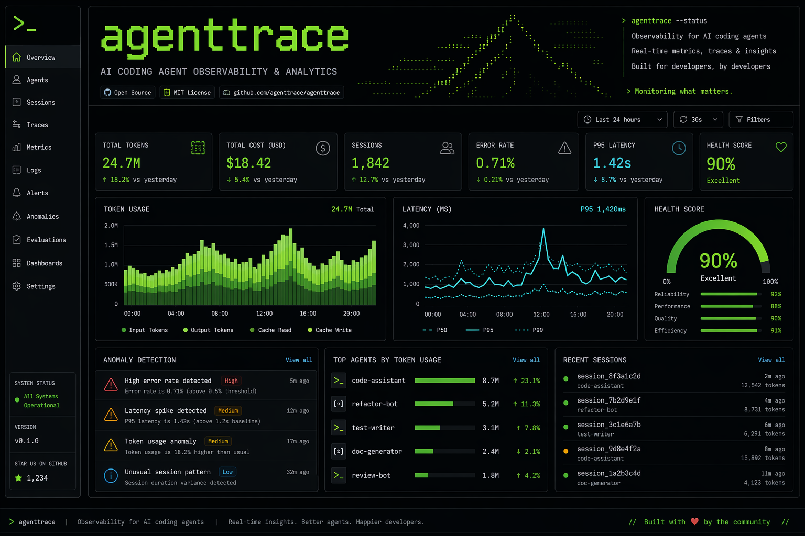

<p align="center">
  
</p>

<p align="center">
  
  
  
  
  
</p>

<h3 align="center">💸 Stop burning cash and hours on invisible AI agent waste</h3>

---

## What is agentwaste?

AI coding agents (Claude Code, Gemini CLI, Codex CLI) burn tokens in loops, retry failures silently, and leave you with a surprise bill. You're wasting **money** on dead tokens and **time** on broken sessions — and you can't even see where.

**agentwaste** finds the waste in both — so you stop paying for nothing and start shipping faster.

## ✨ Features

| Feature | Description |
|---|---|
| 🚀 **Single Binary** | 7.5 MB — `curl -sL ... \| sh` install, no runtime deps |
| 🖥️ **Bubble Tea TUI** | Modern terminal UI: Session List → Detail → Compare (3 views) |
| 🔍 **Multi-Format Auto-Detect** | Hermes Agent / Claude Code / Gemini CLI / OpenClaw — all parsed seamlessly |
| 💸 **Cost & Time Waste** | How much 💰 you burned + ⏱️ time lost to loops, retries, failures |
| 🚨 **6 Anomaly Types** | Hanging, tool failures, latency spikes, shallow thinking, redaction, zero-tool sessions |
| 📊 **Multi-Session Comparison** | Compare across sessions and tools in one table |
| 💯 **Health Score** | 0-100 composite with visual bar and emoji |
| 🤖 **Machine Readable** | JSON output for CI/CD and automation |
| 🐍 **Python v3 Compat** | Original Python code preserved — zero-dep stdlib |

---

## 🚀 Quick Start

### One-liner install

```bash
# Linux / macOS
curl -sL https://raw.githubusercontent.com/luoyuctl/agentwaste/master/install.sh | sh
```

```powershell
# Windows (PowerShell)
iwr -useb https://raw.githubusercontent.com/luoyuctl/agentwaste/master/install.ps1 | iex
```

### npm (cross-platform)

```bash
npm install -g agentwaste
```

### Homebrew (macOS / Linux)

```bash
brew install luoyuctl/tap/agentwaste
```

### Manual build

```bash
git clone https://github.com/luoyuctl/agentwaste.git
cd agentwaste/go
go build -ldflags="-s -w" -o agentwaste ./cmd/agentwaste/
sudo mv agentwaste /usr/local/bin/
```

### Usage

```bash
# Launch TUI dashboard (default, no flags)
agentwaste

# Analyze latest session
agentwaste --latest

# Compare all sessions
agentwaste --compare -d ~/.hermes/sessions

# JSON output (CI/CD)
agentwaste --latest -f json

# List all model pricings (900+ from LiteLLM when cached)
agentwaste --list-models

# Update pricing from LiteLLM community database
agentwaste --update-pricing

# Update + list in one go
agentwaste --update-pricing --list-models

# Specify session language for cost estimation
agentwaste --latest --lang zh    # Chinese (supports zh, ja, ko, en)
```

### TUI Navigation

| Key | Action |
|---|---|
| `↑↓` / `jk` | Navigate sessions |
| `Enter` | View session detail |
| `Tab` | Switch view: List → Detail → Compare |
| `q` / `Esc` | Quit / Back |

---

## 🐍 Python v3 (legacy)

Zero dependencies. Still fully functional.

```bash
git clone https://github.com/luoyuctl/agentwaste.git
cd agentwaste
python3 agentwaste.py --latest -d ~/.hermes/sessions
python3 agentwaste.py --compare -d ~/.hermes/sessions
python3 agentwaste.py --list-models
```

---

## 📊 Sample Output

```
━━━━━━━━━━━━━━━━━━━━━━━━━━━━━━━━━━━━━━━━━━━━━━━━━━━━━━━━━━━━
  AGENTWASTE v0.0.4 — AI Agent Session Performance Report
━━━━━━━━━━━━━━━━━━━━━━━━━━━━━━━━━━━━━━━━━━━━━━━━━━━━━━━━━━━━

💰 TOKEN COST
────────────────────────────────────────
  Input:             1,342  tokens
  Output:            3,947  tokens
  ────────────────────────────────────
  Total tokens:      5,289
  Est. cost:    $     0.0632  (model: claude-sonnet-4)

📊 ACTIVITY
────────────────────────────────────────
  Messages:    2 user  |  42 turns
  Tool calls:  70
  Success:     91% (64/70)

⏱️  LATENCY
────────────────────────────────────────
  min:     12.3s
  median:  457.9s
  p95:     720.1s
  max:     901.0s
  avg:     358.4s
  Duration: 15.4m

🧠 THINKING / COT
────────────────────────────────────────
  Blocks: 20
  Avg:    392 chars
  Total:  7,840 chars
  Quality: 🔴 shallow

🚨 ANOMALIES
────────────────────────────────────────
  🔴 [HIGH] hanging: 1 gap(s) >60s, max=901s
  🟡 [MEDIUM] shallow_thinking: avg reasoning = 392 chars

💯 HEALTH SCORE
────────────────────────────────────────
  🟢  90/100  [██████████████████░░]
```

---

## 🎯 Anomaly Detection

| Type | Trigger | Severity |
|---|---|---|
| 🔴 **Hanging** | Event gap > 60s | high/medium |
| 🔴 **Tool Failures** | Failure rate > 20% | high |
| 🔴 **Latency Spikes** | p95 latency > 120s | low/medium |
| 🟡 **Shallow Thinking** | Avg reasoning < 500 chars | high/medium |
| 🟡 **Redaction** | Redacted thinking blocks | medium |
| 🟡 **No Tools** | 3+ turns with zero tool calls | medium |

---

## 📈 Multi-Session Comparison

```
===============================================================
  AGENTWASTE — Multi-Session Comparison (12 sessions)
===============================================================
Session                   Turns  Tools   Succ     Cost  Health
---------------------------------------------------------------
20260501_103809_71476f6d     42     70    91%  $0.0632   90/100
20260501_084515_a1b2c3d4     18     25    96%  $0.0315   95/100
20260430_192030_e5f6g7h8     65    110    78%  $0.1240   65/100 ⚠️
===============================================================
```

---

## 💡 Use Cases

- **CI/CD Gate** — fail builds when agent sessions degrade below health threshold
- **Cost Audit** — find which sessions are burning tokens uselessly
- **Tool Benchmarking** — compare Claude Code vs Gemini CLI objectively
- **Quality Monitoring** — detect when your agent starts hallucinating or hanging
- **Team Insights** — track agent performance across developers

---

## 🗺️ Roadmap

- [x] `curl -sL ... | sh` install script
- [x] Multi-platform prebuilt binaries (linux/amd64, linux/arm64, darwin/amd64, darwin/arm64, windows/amd64, windows/arm64)
- [x] npm / Homebrew distribution
- [ ] GitHub Action for CI integration
- [ ] Historical trend tracking
- [ ] Web dashboard (React + Charts)
- [ ] VS Code extension
- [ ] OpenCode / Aider / Cursor format support

---

## 🏗️ Architecture

```
go/
├── cmd/agentwaste/main.go      # CLI entry: flags, TUI/CLI dispatch
└── internal/
    ├── engine/
    │   ├── engine.go           # Core: pricing, parsers, anomaly detection, health score
    │   └── report.go           # Reporters: text, JSON, multi-session compare
    └── tui/
        └── tui.go              # Bubble Tea TUI: table-based 3-view dashboard
```

---

## 🤝 Contributing

```bash
git clone https://github.com/luoyuctl/agentwaste.git
cd agentwaste/go
go build ./internal/...    # verify compilation
go build -o agentwaste ./cmd/agentwaste/
./agentwaste --latest      # smoke test
```

---

## 📄 License

MIT © 2025 agentwaste contributors

---

<p align="center">
  <sub>Built with ❤️ for the AI engineering community</sub>
</p>
