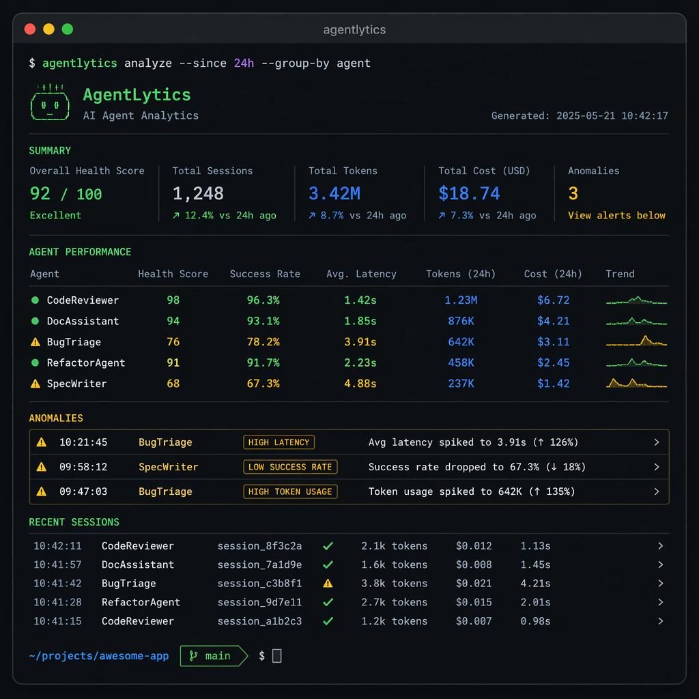

<p align="center">
  
</p>

<p align="center">
  
  
  
  
</p>

<h3 align="center">🔍 Find hanging, token waste, thinking redaction & quality regressions in your AI coding sessions</h3>

---

## What is agenttrace?

AI coding agents (Claude Code, Gemini CLI, Codex CLI, Hermes Agent) produce session logs — but nobody analyzes them systematically. Developers waste tokens, miss quality regressions, and can't compare tools objectively.

**agenttrace** gives you the analytics dashboard your AI agent deserves.

<p align="center">
  
</p>

## ✨ Features

| Feature | Description |
|---|---|
| 🔍 **Multi-Format Auto-Detect** | Hermes Agent / Claude Code / Gemini CLI — all parsed seamlessly |
| 💰 **Token Cost Estimation** | Real pricing for 7 models (Opus $75/M → Flash $0.60/M output) |
| 🚨 **4 Anomaly Types** | Hanging, tool failures, shallow thinking, thinking redaction |
| 📊 **Multi-Session Comparison** | Compare across sessions and tools in one table |
| 💯 **Health Score** | 0-100 composite with visual bar |
| 🏃 **Zero Dependencies** | Pure Python 3.9+ stdlib, no pip install needed |
| 🤖 **Machine Readable** | JSON output for CI/CD and automation |

## 🚀 Quick Start

```bash
git clone https://github.com/luoyuctl/agenttrace.git
cd agenttrace

# Analyze latest session
python3 agenttrace.py --latest

# Specify model for accurate pricing
python3 agenttrace.py -m claude-sonnet-4 session.jsonl

# Compare all sessions
python3 agenttrace.py --compare

# JSON output (for CI or dashboards)
python3 agenttrace.py -f json session.jsonl

# List available models
python3 agenttrace.py --list-models

# Analyze all sessions in a directory
python3 agenttrace.py --dir ~/.hermes/sessions
```

## 📊 Sample Output

```
============================================================
  AGENTTRACE v2 — AI Agent Session Performance Report
============================================================

💰 TOKEN COST
  Input:              1,342 tokens
  Output:             3,947 tokens
  Total tokens:       5,289
  Est. cost:          $0.0632

📊 ACTIVITY:  2 msgs | 42 turns | 70 tool calls | 91% success
⏱️  LATENCY: p50=457.9s | p95=457.9s | max=457.9s
🔧 TOP TOOLS: browser_navigate=31, terminal=14, todo=9
🧠 THINKING: 20 blocks | avg=392 chars | ⚠️ shallow detected
🚨 ANOMALIES: 🟡 shallow thinking, 🔴 high tool failures
💯 HEALTH: 🟢 90/100 [██████████████████░░]
```

## 🎯 Anomaly Detection

| Type | Trigger | Severity | Example |
|---|---|---|---|
| 🔴 **Hanging** | Event gaps > 60s | `high/medium` | Agent stuck waiting |
| 🔴 **Tool Failures** | Failure rate > 20% | `high` | Broken tool chain |
| 🟡 **Shallow Thinking** | Avg reasoning < 500 chars | `medium` | Low-quality reasoning |
| 🟡 **Redaction** | Redacted thinking blocks | `medium` | Hidden reasoning gaps |

## 📈 Multi-Session Comparison

```bash
python3 agenttrace.py --compare
```

```
===============================================================
  AGENTTRACE — Multi-Session Comparison
===============================================================
Session                   Turns  Tools   Succ     Cost  Health
---------------------------------------------------------------
20260501_103809_71476f6d     42     70    91%  $0.0632   90/100
20260501_084515_a1b2c3d4     18     25    96%  $0.0315   95/100
20260430_192030_e5f6g7h8     65    110    78%  $0.1240   65/100 ⚠️
===============================================================
```

## 💡 Use Cases

- **CI/CD Gate** — fail builds when agent sessions degrade below health threshold
- **Cost Audit** — find which sessions are burning tokens uselessly
- **Tool Benchmarking** — compare Claude Code vs Gemini CLI objectively
- **Quality Monitoring** — detect when your agent starts hallucinating or hanging
- **Team Insights** — track agent performance across developers

## 🗺️ Roadmap

- [ ] Web dashboard (React + Charts)
- [ ] GitHub Action for CI integration
- [ ] Historical trend tracking
- [ ] Cost forecasting with projections
- [ ] VS Code extension
- [ ] OpenCode / Aider / Cursor format support

## 🤝 Contributing

Issues and PRs welcome! See [CONTRIBUTING.md](CONTRIBUTING.md) (coming soon).

```bash
git clone https://github.com/luoyuctl/agenttrace.git
cd agenttrace
# make changes...
python3 agenttrace.py --latest  # test locally
# open PR 🚀
```

## 📄 License

MIT © 2025 agenttrace contributors

---

<p align="center">
  <sub>Built with ❤️ for the AI engineering community</sub>
</p>
