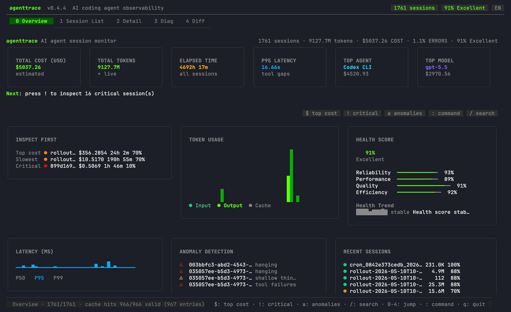
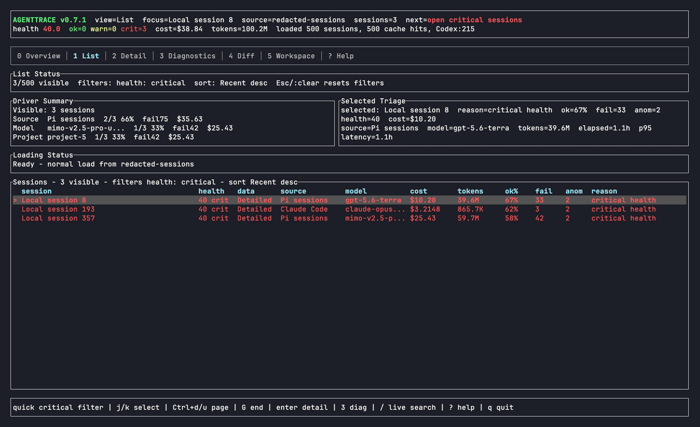
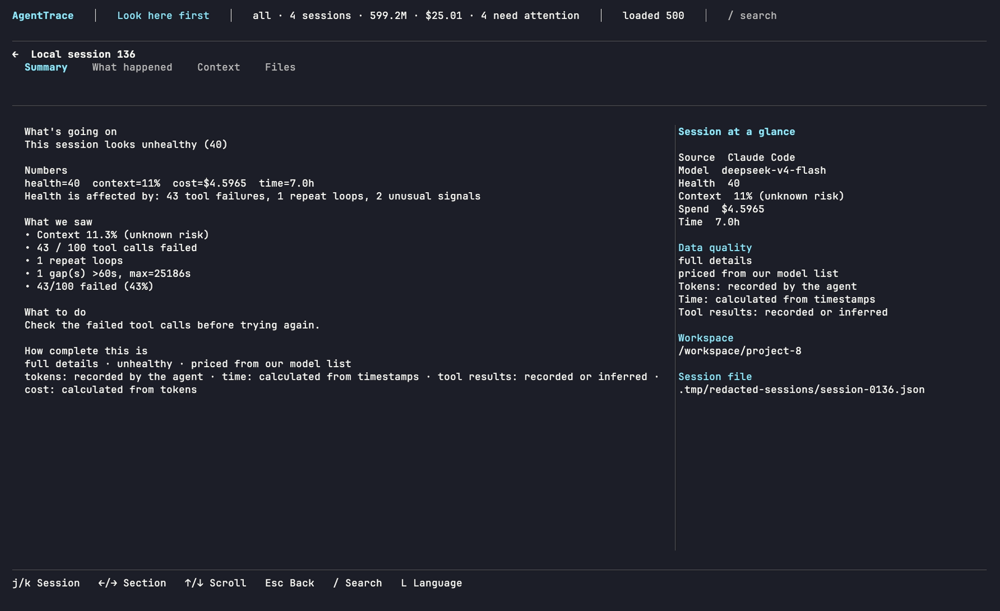
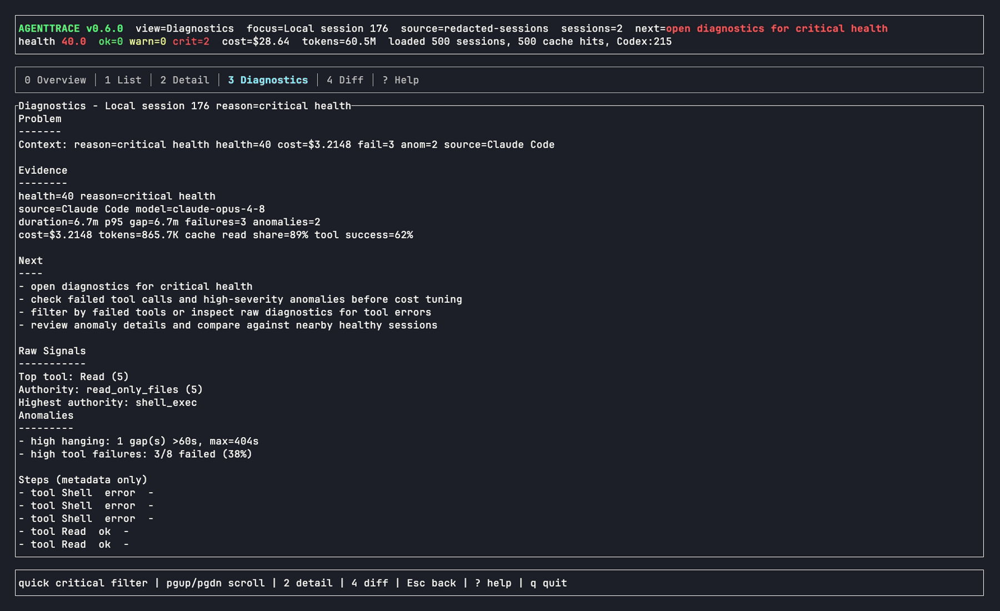

<p align="center">
  
</p>

<h1 align="center">AgentTrace</h1>

<p align="center">
  Local-first TUI and reports for AI coding-agent session history, cost, tokens, time, and slow-run diagnosis.
</p>

<p align="center">
  English | <a href="README.zh-CN.md">简体中文</a>
</p>

<p align="center">
  <a href="https://github.com/luoyuctl/agenttrace/actions/workflows/ci.yml"></a>
  <a href="https://luoyuctl.github.io/agenttrace/"></a>
  <a href="https://github.com/luoyuctl/agenttrace/releases/latest"></a>
  
  
  <a href="https://github.com/luoyuctl/homebrew-tap"></a>
</p>

<p align="center">
  
</p>

---

**agenttrace** is a local-first terminal TUI and report generator for AI coding-agent session history. It reads Claude Code, Codex CLI, Gemini CLI, Qwen Code, Cline, Aider, Cursor exports, Hermes Agent, OpenCode, OpenClaw, Pi, Oh My Pi, Kimi CLI, Copilot-style logs, and generic JSON/JSONL traces, then helps with two daily jobs: see what multiple agents spent across cost, tokens, and time; and diagnose why a task ran slowly.

One `agenttrace` binary provides both interfaces: run it without a report action to open the TUI, or pass flags such as `--sessions` and `--overview` for CLI output.

## Why agenttrace?

AI coding agents now behave like small build systems: they call tools, retry, stall, and spend tokens while you only see the final answer.

**agenttrace** reads the logs your agents already write and puts cost-heavy or slow sessions first.

It helps you answer:

- **What did my agents spend?** Compare historical sessions by agent source, model, input/output/cache tokens, estimated cost, and wall-clock time.
- **Why was this task slow?** Catch long gaps, hanging sessions, retry loops, slow tool calls, large parameters, and context pressure.
- **Did a run regress?** Compare against a local baseline when supplied, then inspect incident timelines and conservative tool authority categories in reports.
- **What should I inspect first?** Rank sessions by cost, duration, turns, health, failures, anomalies, model, source, or text search.
- **Can I inspect this privately?** Everything runs locally; prompts, code, and logs do not need to leave your machine.

## Real local run

These screenshots and figures are a dated, redacted local sample captured for the v0.6.0 source tree. They are not `--demo` output, current telemetry, or test fixtures.

```bash
agenttrace
```

| Overview | Critical sessions |
|---|---|
|  |  |

| Session detail | Diagnostics |
|---|---|
|  |  |

That local run found:

```text
AGENTTRACE v0.6.0
```

| Signal | What agenttrace found |
|---|---:|
| Analyzed sessions | 1,761 |
| Total tokens | 9.13B |
| Estimated cost | $5,037.26 |
| Tool failure rate | 1.1% |
| Critical sessions | 16 |
| Average health | 91% |

## Install

The commands below install the latest public channel, which can lag behind the
`v0.6.0` source tree until its release assets and tap formula are published.
Check the installed version with `agenttrace --version`. To test the current
source tree, use the Git-based Cargo command below.

```bash
curl -sL https://raw.githubusercontent.com/luoyuctl/agenttrace/master/install.sh | sh
```

Other install paths:

```bash
brew install luoyuctl/tap/agenttrace
cargo install --git https://github.com/luoyuctl/agenttrace agenttrace
```

Windows:

```powershell
iwr -useb https://raw.githubusercontent.com/luoyuctl/agenttrace/master/install.ps1 | iex
```

## Common workflows

```bash
# Open the local TUI
agenttrace

# Check detected agent directories and cache state
agenttrace --doctor

# Generate machine-readable evidence
agenttrace --overview -f json

# Focus the same TUI/report scope by time, project, agent, or model
agenttrace --overview -f json --range 7d --project agenttrace
agenttrace --overview -f json --source codex --model-filter gpt-5

# Opt in to long-term derived history; prompts, replies, paths, and tool arguments are not stored
agenttrace --overview -f json --preserve-history
agenttrace --overview -f json --include-history --range 30d

# Search local session metadata without indexing prompt text
agenttrace --search billing
agenttrace --search internal/ws -f json

# Create a self-contained report for CI artifacts or issue links
agenttrace --overview -f html -o agenttrace-overview.html

# Save a local baseline, then compare a later run
agenttrace --overview -f json -o agenttrace-baseline.json
agenttrace --overview -f json \
  --baseline agenttrace-baseline.json \
  -o agenttrace-overview.json

# Fail CI on unhealthy agent runs
agenttrace --overview \
  --fail-under-health 80 \
  --fail-on-critical \
  --max-tool-fail-rate 15
```

## Supported logs

agenttrace supports local sessions from:

Claude Code, Codex CLI, Gemini CLI, Qwen Code, Cline, Aider, Cursor exports, Hermes Agent, OpenCode, OpenClaw, Pi, Oh My Pi, Kimi CLI, Copilot-style logs, and generic JSON/JSONL traces.

## What you get

| Need | agenttrace gives you |
|---|---|
| Historical spend review | Sessions grouped across projects, agents, and models with Today/7d/30d/All ranges |
| Data confidence | Parse skips, cache hits, unknown sources/models, pricing fallbacks, and latest observed session |
| Honest capability levels | `Detailed`, `Aggregate`, or `Limited` per session so missing event-level evidence is never presented as a complete trace |
| Privacy-safe steps | Tool-step metadata and duration when the source provides call IDs and timestamps; no prompt, response, result, or tool-argument body is stored in steps |
| Slow-task diagnosis | Latency stats, long gaps, hanging sessions, retry loops, slow tools, large params, and context pressure |
| Regression evidence | Local baseline comparison when supplied, incident timelines, and conservative tool authority categories in reports |
| First-session triage | Sort and filter by cost, duration, health, failures, anomalies, model, source, or text search |
| Shareable evidence | JSON, Markdown, and self-contained HTML reports |
| Local-first inspection | No hosted backend required |

## Docs

- Site: https://luoyuctl.github.io/agenttrace/
- Sample HTML report: https://luoyuctl.github.io/agenttrace/demo-report.html
- CI setup: [docs/ci-integration.md](docs/ci-integration.md)
- Cursor import: [docs/cursor-import.md](docs/cursor-import.md)
- Parser guide: [docs/parser-guide.md](docs/parser-guide.md)
- Launch notes: [docs/launch-kit.md](docs/launch-kit.md)

Listed in:

- [Awesome Gemini CLI](https://github.com/Piebald-AI/awesome-gemini-cli)
- [Charm in the Wild](https://github.com/charm-and-friends/charm-in-the-wild)
- [Awesome Claude Code and Skills](https://github.com/GetBindu/awesome-claude-code-and-skills)
- [awesome-x-ops](https://github.com/xlabs-club/awesome-x-ops)
- [Awesome DevOps AI](https://github.com/hammadhaqqani/awesome-devops-ai)
- [agentic-ai-knowledge-base](https://github.com/ankurkumarz/agentic-ai-knowledge-base)
- [awesome-harness-engineering](https://github.com/walkinglabs/awesome-harness-engineering)
- [awesome-ai-tools](https://github.com/QAInsights/awesome-ai-tools)
- [awesome-claude-code-toolkit](https://github.com/rohitg00/awesome-claude-code-toolkit)
- [awesome-ai-plugins](https://github.com/hashgraph-online/awesome-ai-plugins)
- [awesome-agent-skills](https://github.com/kodustech/awesome-agent-skills)

## Contributing

Parser PRs are welcome. A good parser contribution usually includes:

- a tiny redacted fixture or synthetic sample
- format detection in `crates/agenttrace-core/src/parser.rs`
- role, timestamp, model, token usage, tool call, and tool error extraction
- tests for successful parsing and malformed input

Generated parser fixtures are deterministic:

```bash
python3 scripts/generate-testdata.py
python3 scripts/generate-testdata.py --check
```

Run before sending a PR:

```bash
cargo test
python3 scripts/generate-testdata.py --check
cargo build --release -p agenttrace
target/release/agenttrace --doctor
```

See [CONTRIBUTING.md](CONTRIBUTING.md) for the full contribution flow.

## License

[MIT](LICENSE) © 2026 agenttrace contributors
