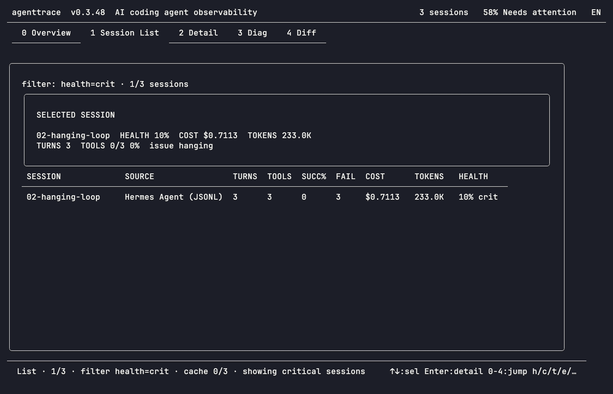

<p align="center">
  
</p>

<p align="center">
  <a href="https://github.com/luoyuctl/agenttrace/actions/workflows/ci.yml"></a>
  <a href="https://luoyuctl.github.io/agenttrace/"></a>
  <a href="https://github.com/luoyuctl/agenttrace/releases/latest"></a>
  <a href="https://pkg.go.dev/github.com/luoyuctl/agenttrace"></a>
  <a href="https://goreportcard.com/report/github.com/luoyuctl/agenttrace"></a>
  
  
  
</p>

<h3 align="center">Find the AI agent sessions that waste tokens, time, and review energy.</h3>

---

## Why agenttrace?

AI coding agents now run like tiny build systems: they call tools, retry, stall, and spend tokens while you only see the final answer.

**agenttrace** reads the local logs your agents already leave behind and shows the sessions that deserve attention first.

It helps you answer:

- **Where did the bill go up?** See input, output, cache tokens, model pricing, and estimated cost.
- **Which run got stuck?** Catch long gaps, hanging sessions, retry loops, and repeated tool failures.
- **What should I fix next?** Rank sessions by health, cost, failures, anomalies, model, source, or text search.
- **Did the workflow regress?** Compare sessions and fail CI when health drops or tool failures spike.
- **Can I inspect this privately?** Everything runs locally; prompts, code, and logs do not need to leave your machine.

## 60-second proof

The built-in demo uses the same parser, scoring, anomaly detection, and report exporters as real scans:

```bash
agenttrace --demo
agenttrace --demo --overview -f json
agenttrace --demo --overview -f html -o agenttrace-demo.html
```

Current demo output surfaces:

```text
AGENTTRACE v0.4.0
```

| Signal | What agenttrace found |
|---|---:|
| Sessions | 3 |
| Total tokens | 278,200 |
| Estimated cost | $0.81 |
| Tool failure rate | 60% |
| Critical sessions | 1 |
| Health trend | 100 -> 66 |

## Install

```bash
curl -sL https://raw.githubusercontent.com/luoyuctl/agenttrace/master/install.sh | sh
```

Other install paths:

```bash
brew install luoyuctl/tap/agenttrace
go install github.com/luoyuctl/agenttrace/cmd/agenttrace@latest
```

Windows:

```powershell
iwr -useb https://raw.githubusercontent.com/luoyuctl/agenttrace/master/install.ps1 | iex
```

The npm wrapper is prepared in `npm/`, but the public package is not published yet.

## Common workflows

```bash
# Open the local TUI
agenttrace

# Try representative demo sessions first
agenttrace --demo

# Check detected agent directories and cache state
agenttrace --doctor

# Generate machine-readable evidence
agenttrace --overview -f json

# Create a self-contained report for CI artifacts or issue links
agenttrace --overview -f html -o agenttrace-overview.html

# Fail CI on unhealthy agent runs
agenttrace --overview \
  --fail-under-health 80 \
  --fail-on-critical \
  --max-tool-fail-rate 15
```

## What it watches

agenttrace supports local sessions from:

Claude Code, Codex CLI, Gemini CLI, Qwen Code, Cline, Aider, Cursor exports, Hermes Agent, OpenCode, OpenClaw, Oh My Pi, Kimi CLI, Copilot-style logs, and generic JSON/JSONL traces.

## What you get

| Need | agenttrace gives you |
|---|---|
| Cost audit | Token totals, cache usage, model pricing, top expensive sessions |
| Reliability triage | Health score, critical/warning buckets, failure rate, anomaly list |
| Slow-run debugging | Latency stats, long gaps, hanging-session detection |
| Prompt/tool improvement | Repeated tool failures, loops, shallow reasoning, redactions |
| Team/CI evidence | JSON, Markdown, and self-contained HTML reports |
| Local-first inspection | No hosted backend required |

## Docs

- Site: https://luoyuctl.github.io/agenttrace/
- Sample HTML report: https://luoyuctl.github.io/agenttrace/demo-report.html
- CI setup: [docs/ci-integration.md](docs/ci-integration.md)
- Cursor import: [docs/cursor-import.md](docs/cursor-import.md)
- Parser guide: [docs/parser-guide.md](docs/parser-guide.md)
- Launch notes: [docs/launch-kit.md](docs/launch-kit.md)

Listed in [Awesome Gemini CLI](https://github.com/Piebald-AI/awesome-gemini-cli), [Charm in the Wild](https://github.com/charm-and-friends/charm-in-the-wild), and [Awesome Claude Code and Skills](https://github.com/GetBindu/awesome-claude-code-and-skills).

## Contributing

Parser PRs are welcome. A good parser contribution usually includes:

- a tiny redacted fixture or synthetic sample
- format detection in `DetectFormat`
- role, timestamp, model, token usage, tool call, and tool error extraction
- tests for successful parsing and malformed input

Run before sending a PR:

```bash
go test ./...
go build -o agenttrace ./cmd/agenttrace/
./agenttrace --doctor
```

See [CONTRIBUTING.md](CONTRIBUTING.md) for the full contribution flow.

## License

[MIT](LICENSE) © 2025 agenttrace contributors
