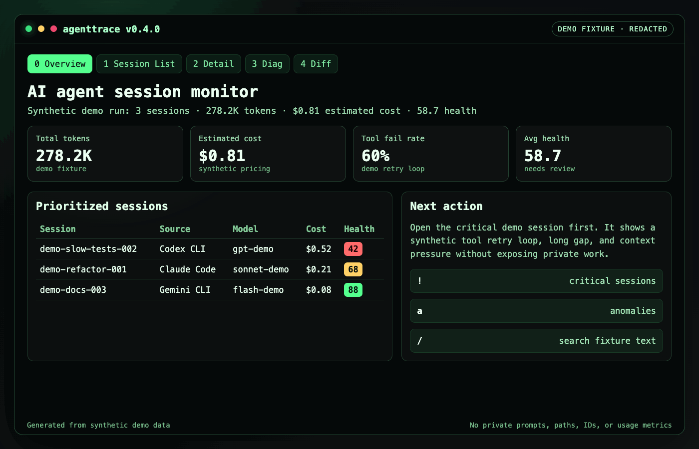
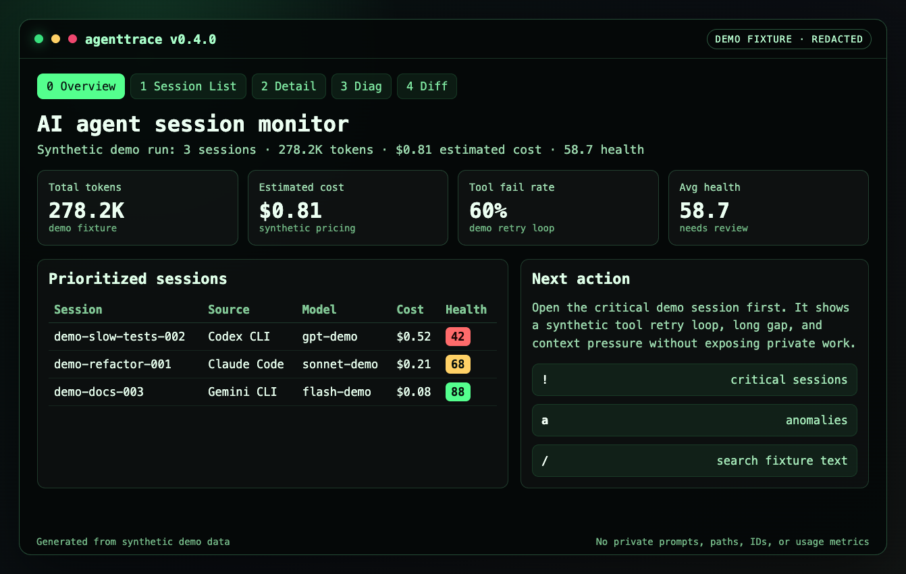
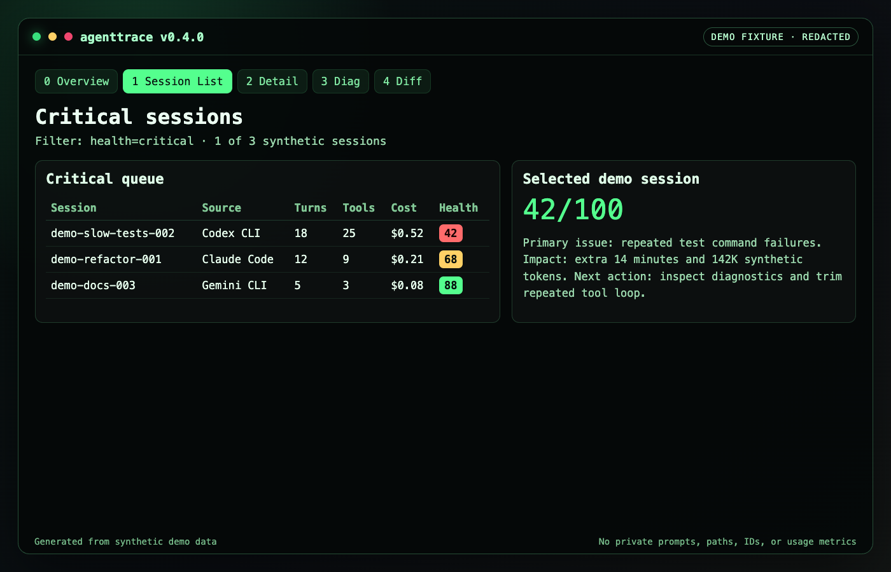
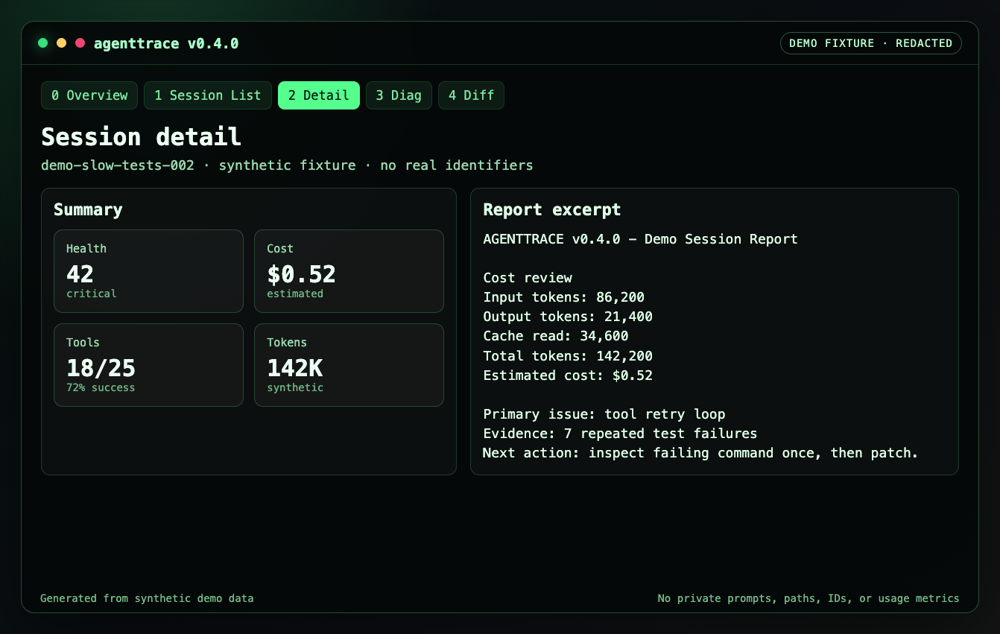
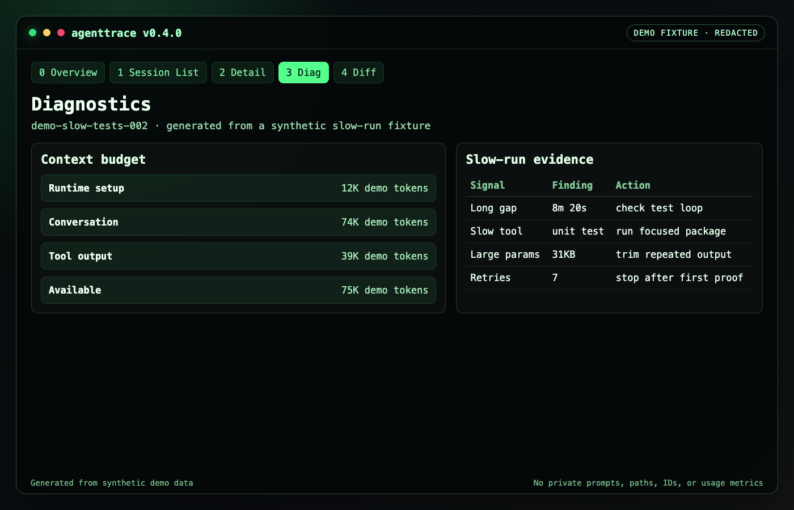

<p align="center">
  
</p>

<h1 align="center">AgentTrace</h1>

<p align="center">
  汇总多个 AI 编程 Agent 的历史成本、Token 和耗时，并定位任务为什么跑得慢。
</p>

<p align="center">
  <a href="README.md">English</a> | 简体中文
</p>

<p align="center">
  <a href="https://github.com/luoyuctl/agenttrace/actions/workflows/ci.yml"></a>
  <a href="https://luoyuctl.github.io/agenttrace/"></a>
  <a href="https://github.com/luoyuctl/agenttrace/releases/latest"></a>
  <a href="https://pkg.go.dev/github.com/luoyuctl/agenttrace"></a>
  <a href="https://goreportcard.com/report/github.com/luoyuctl/agenttrace"></a>
  
  
  
</p>

<p align="center">
  
</p>

---

**agenttrace** 是一个本地 TUI 和报告生成工具，用来分析 AI 编程 Agent 的历史会话。它会读取 Claude Code、Codex CLI、Gemini CLI、Qwen Code、Cursor、Aider、OpenCode、OpenClaw、Hermes Agent、Kimi CLI 和 Copilot 风格日志，主要帮你做两件事：汇总多个 Agent 历史会话的成本、Token 和耗时；定位某次任务为什么跑得慢。

## 为什么需要 agenttrace？

AI 编程 Agent 越来越像一套小型构建系统：会调用工具、重试、卡住、花 token，但你最后往往只看到一段总结。

**agenttrace** 读取这些 Agent 已经写在本机的日志，把最贵、最慢、最值得看的会话排到前面。

它能帮你回答：

- **Agent 花了多少？** 按来源、模型、input/output/cache token、估算成本和真实耗时对比历史会话。
- **任务为什么慢？** 发现长时间空档、挂起会话、重试循环、慢工具调用、大参数和上下文压力。
- **先看哪一次？** 按成本、耗时、轮次、健康分、失败、异常、模型、来源或文本搜索排序。
- **能不能本地看？** 所有分析都在本机完成，不需要上传 prompt、代码和日志。

## 合成演示数据

```bash
agenttrace --demo
```

下面的截图来自生成的演示数据，不包含真实 prompt、源码、本机路径、会话标识符或个人/工作使用指标。

| 概览 | Critical 会话 |
|---|---|
|  |  |

| 会话详情 | 诊断 |
|---|---|
|  |  |

## 安装

```bash
curl -sL https://raw.githubusercontent.com/luoyuctl/agenttrace/master/install.sh | sh
```

其它安装方式：

```bash
brew install luoyuctl/tap/agenttrace
go install github.com/luoyuctl/agenttrace/cmd/agenttrace@latest
```

Windows：

```powershell
iwr -useb https://raw.githubusercontent.com/luoyuctl/agenttrace/master/install.ps1 | iex
```

## 常用工作流

```bash
# 打开本地 TUI
agenttrace

# 检查会话目录探测和缓存状态
agenttrace --doctor

# 生成机器可读证据
agenttrace --overview -f json

# 生成可放到 CI artifact 或 issue 里的独立 HTML 报告
agenttrace --overview -f html -o agenttrace-overview.html
```

## 支持哪些Agent

agenttrace 支持这些本地会话来源：

Claude Code、Codex CLI、Gemini CLI、Qwen Code、Cline、Aider、Cursor exports、Hermes Agent、OpenCode、OpenClaw、Oh My Pi、Kimi CLI、Copilot-style logs，以及通用 JSON/JSONL traces。

## 你会得到什么

| 需求 | agenttrace 提供 |
|---|---|
| 历史消耗总览 | 跨 Agent 会话聚合，展示 token 总量、模型价格、估算成本和真实耗时 |
| 慢任务诊断 | 延迟统计、长间隔、挂起会话、重试循环、慢工具、大参数和上下文压力 |
| 优先级排序 | 按成本、耗时、轮次、健康分、失败、异常、模型、来源或文本搜索筛选 |
| 可分享证据 | JSON、Markdown 和独立 HTML 报告 |

## 文档

- 官网：https://luoyuctl.github.io/agenttrace/
- AI Agent 可观测性指南：https://luoyuctl.github.io/agenttrace/ai-agent-observability.html
- 示例 HTML 报告：https://luoyuctl.github.io/agenttrace/demo-report.html
- CI 集成：[docs/ci-integration.md](docs/ci-integration.md)
- Cursor 导入：[docs/cursor-import.md](docs/cursor-import.md)
- Parser 指南：[docs/parser-guide.md](docs/parser-guide.md)
- 发布说明草案：[docs/launch-kit.md](docs/launch-kit.md)

agenttrace 已被收录在 [Awesome Gemini CLI](https://github.com/Piebald-AI/awesome-gemini-cli)、[Charm in the Wild](https://github.com/charm-and-friends/charm-in-the-wild) 和 [Awesome Claude Code and Skills](https://github.com/GetBindu/awesome-claude-code-and-skills)。

## 贡献

欢迎提交 Parser PR。一个好的 parser 贡献通常包含：

- 一个很小的脱敏 fixture 或合成样本
- `DetectFormat` 中的格式识别
- role、timestamp、model、token usage、tool call、tool error 提取
- 成功解析和坏输入的测试

提交 PR 前请运行：

```bash
go test ./...
go build -o agenttrace ./cmd/agenttrace/
./agenttrace --doctor
```

完整贡献流程见 [CONTRIBUTING.md](CONTRIBUTING.md)。

## 许可证

[MIT](LICENSE) © 2026 agenttrace contributors
