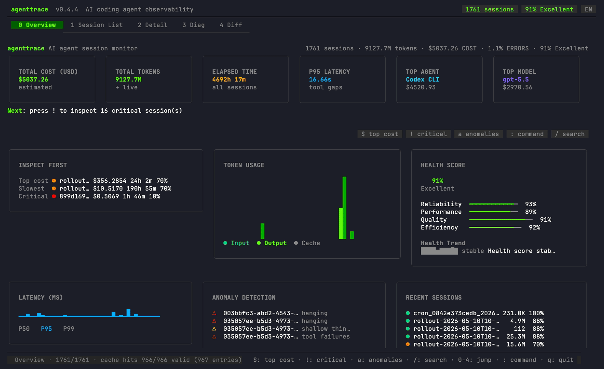
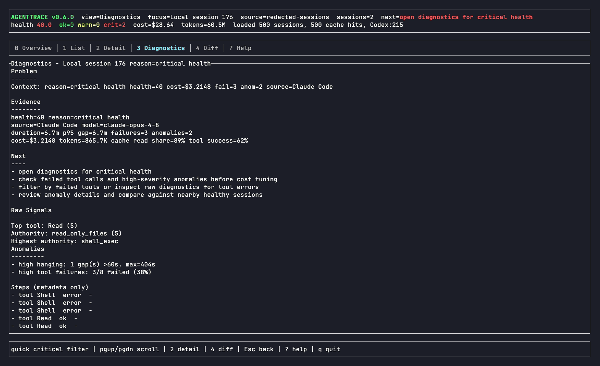

<p align="center">
  
</p>

<h1 align="center">AgentTrace</h1>

<p align="center">
  本地优先的 TUI 和报告工具，用来分析 AI 编程 Agent 会话历史、成本、Token、耗时和慢任务原因。
</p>

<p align="center">
  <a href="README.md">English</a> | 简体中文
</p>

<p align="center">
  <a href="https://github.com/luoyuctl/agenttrace/actions/workflows/ci.yml"></a>
  <a href="https://codecov.io/gh/luoyuctl/agenttrace"></a>
  <a href="https://scorecard.dev/viewer/?uri=github.com/luoyuctl/agenttrace"></a>
  <a href="https://github.com/luoyuctl/agenttrace/releases/latest"></a>
  
  
  <a href="https://github.com/luoyuctl/homebrew-tap"></a>
  <a href="https://www.npmjs.com/package/@zack78/agenttrace"></a>
</p>

<p align="center">
  
</p>

---

**agenttrace** 是一个本地优先的终端 TUI 和报告生成工具，用来分析 AI 编程 Agent 的会话历史。它会读取 Claude Code、Codex CLI、Gemini CLI、Qwen Code、Cline、Aider、Cursor exports、Hermes Agent、OpenCode、OpenClaw、Pi、Oh My Pi、Kimi CLI、Copilot-style logs 和通用 JSON/JSONL traces，主要帮你做两件事：汇总多个 Agent 历史会话的成本、Token 和耗时；定位某次任务为什么跑得慢。

CLI 和 TUI 来自同一个 `agenttrace` 二进制：不带报告动作时进入 TUI，传入 `--sessions`、`--overview` 等参数时输出 CLI 报告。

## 为什么需要 agenttrace？

AI 编程 Agent 越来越像一套小型构建系统：会调用工具、重试、卡住、花 token，但你最后往往只看到一段总结。

**agenttrace** 读取这些 Agent 已经写在本机的日志，把最贵、最慢、最值得看的会话排到前面。

它能帮你回答：

- **Agent 花了多少？** 按来源、模型、input/output/cache token、估算成本和真实耗时对比历史会话。
- **任务为什么慢？** 发现长时间空档、挂起会话、重试循环、慢工具调用、大参数和上下文压力。
- **这次有没有退化？** 在提供本地 baseline 时对比回归，再从报告里查看 incident timeline 和保守的 tool authority 分类。
- **先看哪一次？** 按成本、耗时、轮次、健康分、失败、异常、模型、来源或文本搜索排序。
- **能不能本地看？** 所有分析都在本机完成，不需要上传 prompt、代码和日志。

## 真实本机运行

```bash
agenttrace
```

可通过 `AGENTTRACE_PRICING_FILE=pricing-overrides.json` 提供模型别名和每百万 Token
价格覆盖：

```json
{"aliases":{"provider/raw-model":"my-model"},"prices":{"my-model":{"input":1,"output":2,"cw":0,"cr":0}}}
```

| 概览 | Critical 会话 |
|---|---|
|  |  |

| 会话详情 | 诊断 |
|---|---|
|  |  |

## 安装

macOS 和 Linux：

```bash
curl -fsSL https://raw.githubusercontent.com/luoyuctl/agenttrace/master/install.sh | sh
```

Windows PowerShell：

```powershell
irm https://raw.githubusercontent.com/luoyuctl/agenttrace/master/install.ps1 | iex
```

Windows CMD：

```bat
curl -fsSL https://raw.githubusercontent.com/luoyuctl/agenttrace/master/install.cmd -o install.cmd && install.cmd && del install.cmd
```

安装脚本会下载对应平台的发布版程序，按发布的校验和验证 SHA-256，并把安装目录
（`~/.local/bin`，Windows 上为 `%LOCALAPPDATA%\agenttrace`）加入 PATH。
设置 `AGENTTRACE_VERSION=v0.9.1`（PowerShell 用 `-Version v0.9.1`）可固定版本。

包管理器：

```bash
# macOS 和 Linux
brew install luoyuctl/tap/agenttrace

# macOS、Linux 和 Windows（需要 Node.js 18+）
npm install -g @zack78/agenttrace

# 从源码安装
cargo install --git https://github.com/luoyuctl/agenttrace agenttrace
```

可用 `agenttrace --version` 检查实际版本。

### 更新

| 安装方式 | 更新命令 |
| --- | --- |
| 安装脚本 | `agenttrace update`（加 `--check` 只检查不更新） |
| Homebrew | `brew upgrade luoyuctl/tap/agenttrace` |
| npm | `npm install -g @zack78/agenttrace@latest` |
| cargo | `cargo install --git https://github.com/luoyuctl/agenttrace agenttrace --force` |

`agenttrace update` 会先校验发布版的校验和再替换程序；包管理器安装的会提示改用对应的包管理器更新。

## Quickstart

```bash
agenttrace
```

报告、帮助和错误信息跟随 `--lang en|zh`（默认 `en`；TUI 里按 `L` 切换的语言会被记住）。
JSON 字段名、代码值和 `--sessions` 的 TSV 表头等机读内容始终保持英文。

```bash
agenttrace --overview --lang zh
```

### 按时间统计用量

```bash
# 按天 / ISO 周 / 月汇总。每条用量按自身时间戳归入周期，跨零点的会话会被拆开。
# 默认使用本机时区。
agenttrace --daily --range 30d
agenttrace --weekly --tz utc -f json
agenttrace --monthly --tz +08:00

# 5 小时窗口：消耗速率与窗口结束预测。基于本地日志估算，
# 服务商限流在服务端计算，可能与此不同。
agenttrace --blocks --token-limit 50000000 --cost-limit 100
```

## 你会得到什么

| 需求 | agenttrace 提供 |
| --- | --- |
| 历史消耗总览 | 跨 Agent 会话聚合，展示 token 总量、模型价格、估算成本和真实耗时 |
| 数据可信度 | 展示解析跳过、缓存命中、未知来源/模型、价格回退和字段覆盖率 |
| 能力降级 | 每个会话标记为 `Detailed`、`Aggregate` 或 `Limited`，不把缺失的事件证据包装成完整 Trace |
| 脱敏步骤 | 来源提供调用 ID 和时间戳时展示 Tool Step 元数据和耗时，不在 Step 中保存 prompt、回复、结果或工具参数正文 |
| 慢任务诊断 | 延迟统计、长间隔、挂起会话、重试循环、慢工具、大参数和上下文压力 |
| 回归证据 | 在提供本地 baseline 时进行对比，并在报告中展示 incident timeline 和保守的 tool authority 分类 |
| 优先级排序 | 按成本、耗时、轮次、健康分、失败、异常、模型、来源或文本搜索筛选 |
| 可分享证据 | JSON、Markdown 和独立 HTML 报告 |

## 文档

- 文档导航：[docs/README.md](docs/README.md)
- CI 集成：[docs/guides/ci-integration.md](docs/guides/ci-integration.md)
- 治理报告：[docs/guides/governance-reports.md](docs/guides/governance-reports.md)
- Cursor 导入：[docs/guides/cursor-import.md](docs/guides/cursor-import.md)
- Parser 指南：[docs/guides/parser-guide.md](docs/guides/parser-guide.md)
- 发布维护指南：[docs/maintainers/distribution.md](docs/maintainers/distribution.md)

agenttrace 已被这些项目收录：

- [awesome-mac](https://github.com/jaywcjlove/awesome-mac)
- [antigravity-awesome-skills](https://github.com/sickn33/antigravity-awesome-skills)
- [awesome-claude-skills](https://github.com/BehiSecc/awesome-claude-skills)

## 贡献

欢迎提交 Parser PR。一个好的 parser 贡献通常包含：

- 一个很小的脱敏 fixture 或合成样本
- `crates/agenttrace-core/src/parser.rs` 中的格式识别
- role、timestamp、model、token usage、tool call、tool error 提取
- 成功解析和坏输入的测试

提交 PR 前请运行：

```bash
cargo test
cargo build --release -p agenttrace
target/release/agenttrace --doctor
```

完整贡献流程见 [CONTRIBUTING.md](CONTRIBUTING.md)。

## 许可证

[MIT](LICENSE) © 2026 agenttrace contributors
